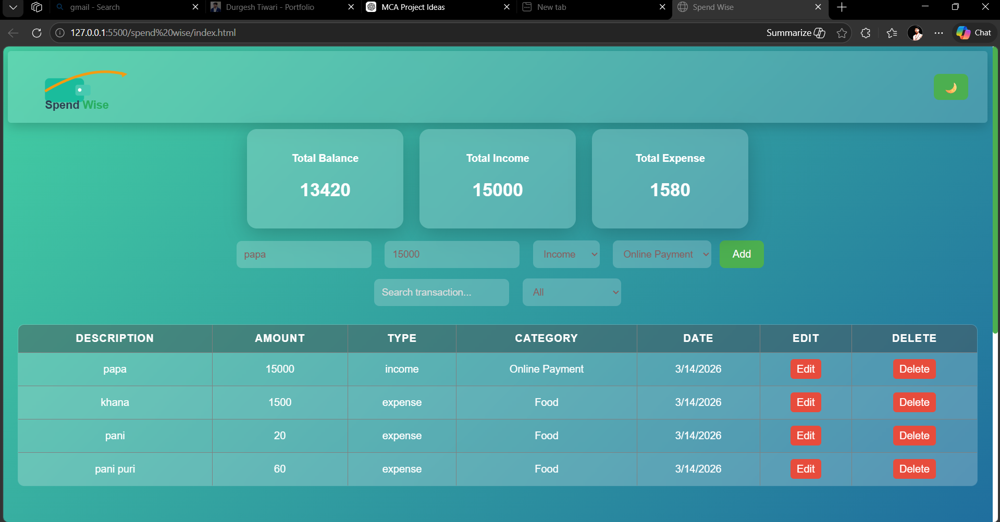
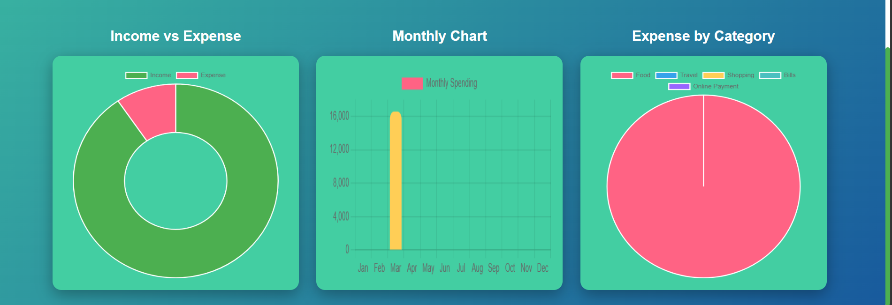
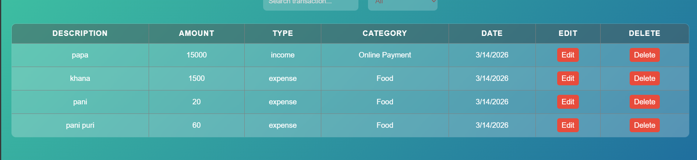

# 💰 Spendwise


Spend wise is a simple web application that helps users track their **income and expenses**.
It provides charts, analytics, and an interactive dashboard to visualize financial data.

---

# 🚀 Features

- Add income and expense transactions  
- Edit and delete transactions  
- Local storage data persistence  
- Dashboard cards for **Balance, Income, Expense**  
- Monthly spending **Bar Chart**  
- **Income vs Expense Doughnut Chart**  
- **Expense by Category Pie Chart**  
- Search transactions  
- Filter transactions by category  
- Dark / Light mode toggle  
- Responsive dashboard UI
---

# 🛠 Tech Stack

| Technology   | Purpose            |
| ------------ | ------------------ |
| HTML5        | Structure          |
| CSS3         | UI Design          |
| JavaScript   | Functionality      |
| Chart.js     | Data Visualization |
| LocalStorage | Data Storage       |

---

# 📁 Project Structure

```
Spendwise
│
├── index.html
├── style.css
├── script.js
└── README.md
```

---

# ⚙️ How to Run

1. Download or clone the repository


 git clone https://github.com/durg83034/SpendWise.git


2. Open the folder

3. Run the project by opening:

```
index.html
```

   in your browser.

---

## 📸 Screenshots

### Dashboard


### Charts


### Transactions Table


## 🌐 Live Demo

**Check out the live version of the project here:**


🔗 [https://yourusername.github.io/spendwise](https://durg83034.github.io/SpendWise/)

# 👨‍💻 Author

**Durgesh**

---

# ⭐ Support

If you like this project, please give it a **star ⭐ on GitHub**.
